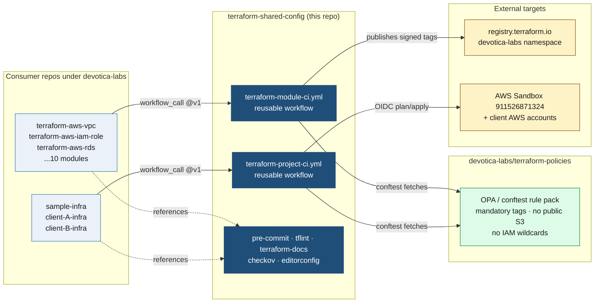
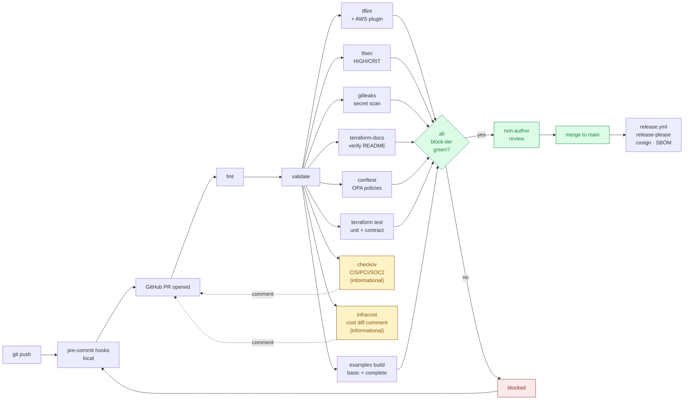

# terraform-shared-config

[](LICENSE)

Canonical reusable GitHub Actions workflows and Terraform tooling configs for the Devotica Terraform practice. Consumed by every repo under [`devotica-labs`](https://github.com/devotica-labs).

> **Why this repo exists.** One source of truth for the entire CI pipeline definition and tool configs. Bumping a tool version, tightening a gate, or adding a new check is a single PR here that propagates to every consumer on their next `@vX.Y.Z` bump.

## Version

| Tag | Notes |
|---|---|
| `v1.1.0` | Portability fixes from real-world usage: tfsec → trivy (IP-allowlist friendly), gitleaks → upstream binary (no paid org license), conftest → upstream binary (instrumenta action is dead), terraform-docs gains opt-in auto-update mode. New inputs: `terraform-docs-auto-update`, `gitleaks-version`, `conftest-version`, `trivy-severity`. Backwards compatible: existing `@v1` consumers see no input changes. |
| `v1.0.0` | Initial scaffold — module-ci + project-ci reusable workflows, canonical tflint/checkov/pre-commit configs. |

## How it fits together



One PR here updates the CI pipeline for every consumer repo on their next `@vX.Y.Z` bump.

## Module pipeline — what runs on every PR

The `terraform-module-ci.yml` workflow runs this gauntlet on every pull request to a consumer module repo. Block-tier jobs gate the merge; inform-tier jobs post comments and never block.



## What's inside

| Path | Purpose |
|---|---|
| [`.github/workflows/terraform-module-ci.yml`](./.github/workflows/terraform-module-ci.yml) | Reusable CI for module repos (`terraform-aws-*`) — fmt, validate, tflint, tfsec, Checkov, conftest, gitleaks, terraform test, terraform-docs verify, examples build, infracost |
| [`.github/workflows/terraform-project-ci.yml`](./.github/workflows/terraform-project-ci.yml) | Reusable CI for project monorepos (`<client>-infra`) — same lint stack plus per-service plan/apply via OIDC |
| [`pre-commit/.pre-commit-config.yaml`](./pre-commit/.pre-commit-config.yaml) | Canonical pre-commit hooks — copy or symlink into each repo root |
| [`tflint/.tflint.hcl`](./tflint/.tflint.hcl) | tflint rules with the AWS plugin and tagging enforcement |
| [`terraform-docs/.terraform-docs.yml`](./terraform-docs/.terraform-docs.yml) | terraform-docs config — auto-generates README inputs/outputs tables |
| [`checkov/.checkov.yaml`](./checkov/.checkov.yaml) | Checkov config — informational by default, flip to blocking once skip list is reviewed |
| [`.editorconfig`](./.editorconfig) | Whitespace / line-ending settings — copy to each repo root |

## Consuming this repo from a module repo

In `github.com/devotica-labs/terraform-aws-<name>/.github/workflows/ci.yml`:

```yaml
name: ci

on:
  pull_request:
    branches: [main]
  push:
    branches: [main]

jobs:
  ci:
    uses: devotica-labs/terraform-shared-config/.github/workflows/terraform-module-ci.yml@v1
    with:
      terraform-version: "1.9.5"
      working-directory: "."
      run-checkov: true
      run-infracost: true
    secrets: inherit
```

## Consuming this repo from a project monorepo

In `github.com/devotica-labs/<client>-infra/.github/workflows/plan.yml`:

```yaml
name: plan

on:
  pull_request:
    branches: [main]

jobs:
  plan:
    uses: devotica-labs/terraform-shared-config/.github/workflows/terraform-project-ci.yml@v1
    with:
      services: '["vpc","s3","rds","eks"]'
      environment: "dev"
      aws-region: "ap-south-1"
      aws-role-arn: "arn:aws:iam::911526871324:role/GitHubActionsTerraform"
      run-plan: true
      run-apply: false
    secrets: inherit
```

The matching `apply.yml` flips `run-plan: false` and `run-apply: true`, gated by a GitHub Environment with required reviewers.

## Versioning policy

This repo follows semantic versioning via Git tags. Consumers pin to a major version:

- `@v1` — auto-tracks latest `v1.x.y` (recommended for most consumers)
- `@v1.2.0` — exact pin (use when chasing a regression)
- `@main` — **not supported.** Don't pin to floating refs.

Breaking changes (removing a workflow input, changing default behaviour, bumping the minimum Terraform version) trigger a major bump. Adding a new optional input is minor; tightening a non-default rule is patch.

## Contributing

See [CONTRIBUTING.md](./CONTRIBUTING.md). External pull requests are not accepted at this time; please file issues for bug reports and feature requests.

## License

Apache-2.0. See [LICENSE](./LICENSE).
