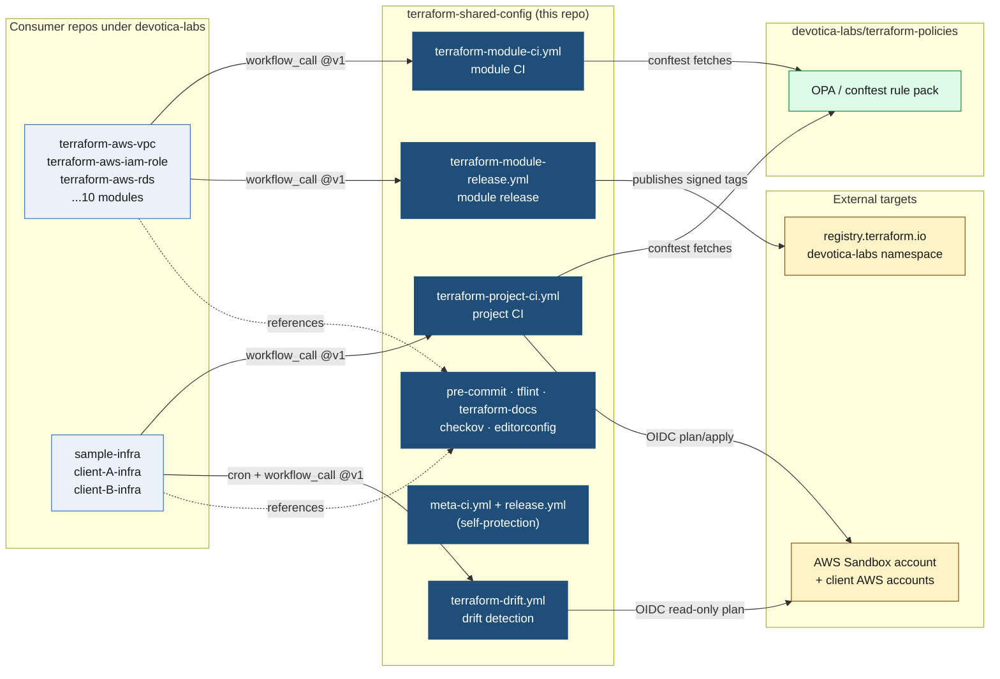
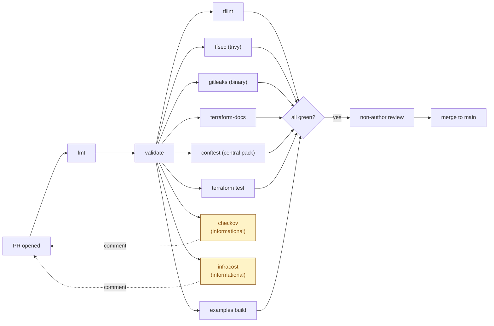
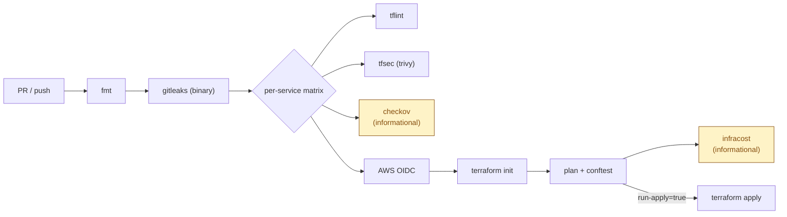

# terraform-shared-config

[](LICENSE)
[](https://github.com/devotica-labs/terraform-shared-config/actions/workflows/meta-ci.yml)
[](https://github.com/devotica-labs/terraform-shared-config/actions/workflows/release.yml)

Canonical reusable GitHub Actions workflows and Terraform tooling configs for the Devotica Terraform practice. Consumed by every repo under [`devotica-labs`](https://github.com/devotica-labs).

> **Why this repo exists.** One source of truth for the entire CI / release / drift pipeline. Bumping a tool version, tightening a gate, or adding a new check is a single PR here that propagates to every consumer on their next `@vX.Y.Z` bump (or automatically, if pinned at floating `@v1`).

---

## Quick reference — when each workflow runs

This repo ships **six** workflow files. They split into two groups by what triggers them:

| Workflow | `on:` trigger | Runs in **this** repo? | Runs in **consumer** repos? |
|---|---|:---:|:---:|
| [`meta-ci.yml`](#meta-ciyml) | `pull_request` + `push` to `main` | ✅ every PR / push | — |
| [`release.yml`](#releaseyml) | `push` to `main` | ✅ on `main` push (release-please) | — |
| [`terraform-module-ci.yml`](#terraform-module-ciyml) | `workflow_call` only | — | ✅ via wrapper |
| [`terraform-project-ci.yml`](#terraform-project-ciyml) | `workflow_call` only | — | ✅ via wrapper |
| [`terraform-module-release.yml`](#terraform-module-releaseyml) | `workflow_call` only | — | ✅ via wrapper |
| [`terraform-drift.yml`](#terraform-driftyml) | `workflow_call` only | — | ✅ via wrapper (cron) |

Reusable workflows do **not** fire when this repo is pushed. They only fire when a consumer repo invokes them via `uses: devotica-labs/terraform-shared-config/.github/workflows/<file>@v1`.

---

## Architecture



---

## Workflows

### `meta-ci.yml`

**Type:** Self-CI. **Trigger:** `pull_request` + `push` to `main`. **Visibility:** runs only in this repo.

This repo's reusable workflows are consumed by every other repo in the org — a typo here breaks them all. `meta-ci` is the safety net that catches issues before they ever reach the floating `@v1` tag.

| Job | What it checks |
|---|---|
| `actionlint` | `actionlint` v1.7.7 over every workflow YAML — unknown contexts, malformed `if:`, bad `uses:` SHAs |
| `yamllint` | `yamllint` v1.35.1 strict mode (line-length and document-start relaxed for GHA conventions) |
| `release-please-schema` | JSON-schema validates `.github/release-please-config.json` and `…manifest.json` against upstream schemas |

If any job fails, the PR is blocked. Branch protection on `main` should require `meta-ci` as a status check.

---

### `release.yml`

**Type:** Self-CI. **Trigger:** `push` to `main`. **Visibility:** runs only in this repo.

Versions this repo. On every push to `main`, [release-please](https://github.com/googleapis/release-please) opens or updates a release PR with the next version bump and a generated changelog.

| Job | Behaviour |
|---|---|
| `release-please` | Opens a release PR (e.g. `chore(main): release 1.2.0`). On merge of that PR, creates the `v1.2.0` GitHub Release and pushes the immutable tag |
| `retag-floating-major` | Runs only when `release_created == true`. Force-moves the floating `v<MAJOR>` tag (e.g. `v1`) to the newly published release so every consumer pinned at `@v1` picks up the change automatically |

> You never `git tag` this repo by hand. Conventional Commits (`feat:`, `fix:`, `feat!:`) drive the bump.

---

### `terraform-module-ci.yml`

**Type:** Reusable. **Trigger:** `workflow_call`. **Consumed by:** every `devotica-labs/terraform-aws-*` module repo.

The full module-CI gauntlet — fmt, validate, lint, sec, policy, test, docs, examples, cost.

#### Inputs

| Input | Type | Default | Purpose |
|---|---|---|---|
| `terraform-version` | string | `1.9.5` | Pin for `hashicorp/setup-terraform` |
| `working-directory` | string | `.` | Module root (use when the repo nests modules) |
| `run-terraform-test` | bool | `true` | `terraform test -filter=tests/unit.tftest.hcl` and `…/contract.tftest.hcl` |
| `run-tflint` | bool | `true` | tflint with AWS plugin, recursive |
| `run-tfsec` | bool | `true` | tfsec HIGH/CRITICAL (job name preserved; v1.1+ implementation backed by trivy) |
| `run-checkov` | bool | `true` | Checkov terraform framework |
| `run-conftest` | bool | `true` | Pulls `terraform-policies@<conftest-policy-ref>` and runs conftest against `terraform plan -json` |
| `run-terraform-docs-check` | bool | `true` | terraform-docs README sync (mode controlled by `terraform-docs-auto-update`) |
| `terraform-docs-auto-update` | bool | `false` | `true` → bot inject + git-push README; `false` → CI fails on diff |
| `run-infracost` | bool | `true` | PR cost-diff comment |
| `run-examples-build` | bool | `true` | `terraform validate` in `examples/basic` + `examples/complete` |
| `checkov-blocking` | bool | `false` | Flip Checkov to blocking once skip list is reviewed |
| `conftest-policy-ref` | string | `v1` | Git ref of `terraform-policies` to use |
| `gitleaks-version` | string | `8.18.4` | OSS gitleaks binary version (no paid license) |

#### Secrets

| Secret | Required | Purpose |
|---|---|---|
| `INFRACOST_API_KEY` | optional | When unset, infracost job skips silently |

#### Pipeline shape



#### Consumer wrapper

`github.com/devotica-labs/terraform-aws-<name>/.github/workflows/ci.yml`:

```yaml
name: CI

on:
  pull_request:
    branches: [main]
  push:
    branches: [main]

permissions:
  contents: write          # required if terraform-docs-auto-update = true
  pull-requests: write
  id-token: write

jobs:
  ci:
    uses: devotica-labs/terraform-shared-config/.github/workflows/terraform-module-ci.yml@v1
    with:
      terraform-version: "1.9.5"
      working-directory: "."
      terraform-docs-auto-update: true
    secrets: inherit
```

---

### `terraform-project-ci.yml`

**Type:** Reusable. **Trigger:** `workflow_call`. **Consumed by:** `sample-infra` and every `<client>-infra` project monorepo.

Per-service plan / apply pipeline for service-first project layouts (`vpc/`, `s3/`, `rds/`, …) per Foundation Plan §4.

#### Inputs

| Input | Type | Required | Default | Purpose |
|---|---|---|---|---|
| `services` | string (JSON array) | ✓ | — | e.g. `'["vpc","s3","rds"]'` — drives the per-service matrix |
| `environment` | string | ✓ | — | `sandbox` / `dev` / `stg` / `prod` — selects `tfvars/<env>.tfvars` and `backend/config.<env>.hcl` |
| `aws-role-arn` | string | ✓ | — | OIDC IAM role to assume in the target account |
| `aws-region` | string | — | `ap-south-1` | |
| `terraform-version` | string | — | `1.9.5` | |
| `run-plan` | bool | — | `true` | Run plan + conftest + infracost. Set false on apply jobs |
| `run-apply` | bool | — | `false` | Run `terraform apply -auto-approve`. Set true on apply jobs gated by GitHub Environment |
| `run-tflint` / `run-tfsec` / `run-checkov` / `run-conftest` / `run-infracost` | bool | — | `true` | Per-job toggles |
| `conftest-policy-ref` | string | — | `v1` | Git ref of `terraform-policies` |
| `gitleaks-version` | string | — | `8.18.4` | |

#### Secrets

| Secret | Required | Purpose |
|---|---|---|
| `INFRACOST_API_KEY` | optional | PR cost-diff comments — skips silently when unset |

#### Pipeline shape



#### Consumer wrappers

PR-time plan workflow:

```yaml
# sample-infra/.github/workflows/terraform-plan.yml
on:
  pull_request:
    branches: [main]

permissions:
  id-token: write
  contents: read
  pull-requests: write

jobs:
  plan:
    uses: devotica-labs/terraform-shared-config/.github/workflows/terraform-project-ci.yml@v1
    with:
      services: '["vpc"]'
      environment: "sandbox"
      aws-role-arn: ${{ vars.AWS_OIDC_ROLE_ARN }}
      run-plan: true
      run-apply: false
    secrets: inherit
```

Merge-time apply workflow:

```yaml
# sample-infra/.github/workflows/terraform-apply.yml
on:
  push:
    branches: [main]

jobs:
  apply_sandbox:
    uses: devotica-labs/terraform-shared-config/.github/workflows/terraform-project-ci.yml@v1
    with:
      services: '["vpc"]'
      environment: "sandbox"
      aws-role-arn: ${{ vars.AWS_OIDC_ROLE_ARN }}
      run-plan: false
      run-apply: true
    secrets: inherit
  # apply_prod (gated by GitHub Environment "production") — see comment in
  # the file for the enable-procedure.
```

---

### `terraform-module-release.yml`

**Type:** Reusable. **Trigger:** `workflow_call`. **Consumed by:** every `devotica-labs/terraform-aws-*` module repo via a thin `release.yml` wrapper triggered on push to `main`.

Replaces the duplicated release pipeline that used to live inline in every module repo.

#### Pipeline

```
push to main
   ↓
release-please opens / updates release PR (Conventional Commits → version + CHANGELOG)
   ↓ (PR merged)
GitHub Release created · vX.Y.Z tag pushed
   ↓
cosign keyless-sign tag (Sigstore Fulcio + Rekor transparency log)
   ↓
CycloneDX SBOM generated for the module
   ↓
Both artifacts attached to the GitHub Release
   ↓
Floating v<MAJOR> tag force-moved to the new release
```

#### Inputs

| Input | Default | Purpose |
|---|---|---|
| `release-type` | `terraform-module` | release-please release-type |
| `release-please-config-file` | `.github/release-please-config.json` | release-please config |
| `release-please-manifest-file` | `.github/release-please-manifest.json` | release-please manifest |
| `cosign-installer-version` | `v3` | `sigstore/cosign-installer` (informational; SHA-pinned in workflow) |
| `retag-floating-major` | `true` | Force-move `v<MAJOR>` after publish |

#### Permissions required at the wrapper

```yaml
permissions:
  contents: write       # create releases, tag, force-move floating tag
  pull-requests: write  # release-please opens release PRs
  id-token: write       # cosign keyless OIDC signing (Fulcio)
```

#### Consumer wrapper

```yaml
# terraform-aws-vpc/.github/workflows/release.yml
name: release

on:
  push:
    branches: [main]

permissions:
  contents: write
  pull-requests: write
  id-token: write

jobs:
  release:
    uses: devotica-labs/terraform-shared-config/.github/workflows/terraform-module-release.yml@v1
    secrets: inherit
```

---

### `terraform-drift.yml`

**Type:** Reusable. **Trigger:** `workflow_call`. **Consumed by:** `sample-infra` and every `<client>-infra` repo via a thin wrapper triggered on `schedule: cron`.

Daily drift detection — runs `terraform plan -detailed-exitcode` per service per environment. Exit code `2` (drift detected) opens a GitHub issue and fails the workflow run so it surfaces on the repo dashboard.

#### Inputs

| Input | Type | Required | Default | Purpose |
|---|---|---|---|---|
| `services` | string (JSON array) | ✓ | — | e.g. `'["vpc","s3","rds"]'` |
| `environment` | string | ✓ | — | Target env — must match an existing `tfvars/<env>.tfvars` |
| `aws-role-arn` | string | ✓ | — | OIDC IAM role |
| `aws-region` | string | — | `ap-south-1` | |
| `terraform-version` | string | — | `1.9.5` | Must match the apply path |
| `open-issue-on-drift` | bool | — | `true` | Open a GitHub issue on exit code 2 |
| `fail-on-drift` | bool | — | `true` | Fail the run on drift (visible on dashboard) |

#### Permissions required at the wrapper

```yaml
permissions:
  id-token: write   # OIDC into target AWS account
  contents: read
  issues: write     # open drift issue
```

#### Consumer wrapper

```yaml
# sample-infra/.github/workflows/drift.yml
name: drift

on:
  schedule:
    - cron: "0 4 * * *"   # 04:00 UTC daily
  workflow_dispatch:        # manual ad-hoc trigger

permissions:
  id-token: write
  contents: read
  issues: write

jobs:
  drift_sandbox:
    uses: devotica-labs/terraform-shared-config/.github/workflows/terraform-drift.yml@v1
    with:
      services: '["vpc"]'
      environment: "sandbox"
      aws-role-arn: ${{ vars.AWS_OIDC_ROLE_ARN }}
    secrets: inherit
```

---

## Tool configs

Workflow files are only half the story. The other half is the canonical tool configuration that every repo should drop into its root.

| Path | Drop into consumer repo as | Purpose |
|---|---|---|
| [`pre-commit/.pre-commit-config.yaml`](./pre-commit/.pre-commit-config.yaml) | `.pre-commit-config.yaml` | Local pre-commit hooks — fmt, validate, tflint, gitleaks |
| [`tflint/.tflint.hcl`](./tflint/.tflint.hcl) | `.tflint.hcl` | tflint AWS plugin + tagging enforcement |
| [`terraform-docs/.terraform-docs.yml`](./terraform-docs/.terraform-docs.yml) | `.terraform-docs.yml` | terraform-docs config — generates README inputs/outputs |
| [`checkov/.checkov.yaml`](./checkov/.checkov.yaml) | `.checkov.yaml` | Checkov skip list (informational mode by default) |
| [`.editorconfig`](./.editorconfig) | `.editorconfig` | Whitespace / line-ending baseline |

> Symlink rather than copy where you can — that way one PR here updates every consumer. CI catches drift via the `fmt` and `terraform-docs` jobs.

---

## Versioning policy

This repo follows [SemVer](https://semver.org) via Git tags. Consumers pin to a major version:

| Pin form | Behaviour |
|---|---|
| `@v1` (recommended) | Auto-tracks the latest `v1.x.y`. The `release.yml` workflow force-moves this floating tag on every release |
| `@v1.2.0` (exact) | Use only when chasing a regression — pin, fix, then return to `@v1` |
| `@main` | **Not supported.** Don't pin to floating refs |

What triggers each kind of bump:

| Bump | Triggered by |
|---|---|
| **Major** (`v1.x.y` → `v2.0.0`) | Removing a workflow input · changing default behaviour in a way consumers can break on · raising the minimum Terraform version |
| **Minor** (`v1.1.0` → `v1.2.0`) | Adding a new optional input · adding a new job · adding a new reusable workflow file |
| **Patch** (`v1.1.0` → `v1.1.1`) | Bumping a SHA-pinned action · tightening a non-default rule · doc-only changes |

Conventional Commits drive this. `feat:` → minor, `fix:` → patch, `feat!:` (or footer `BREAKING CHANGE:`) → major.

---

## Releases

| Tag | Date | Highlights |
|---|---|---|
| **`v1.1.0`** *(in progress on `feat/portable-ci-tools`)* | TBD | Portability fixes: tfsec → trivy (IP-allowlist friendly) · gitleaks → upstream binary (no paid org license) · conftest → upstream binary · terraform-docs gains opt-in auto-update mode. New inputs: `terraform-docs-auto-update`, `gitleaks-version`, `conftest-version`, `trivy-severity`. Backwards-compatible with v1 consumers — no input contract changes |
| `v1.0.0` | 2026-04 | Initial scaffold — `terraform-module-ci.yml` + `terraform-project-ci.yml`, canonical tflint/checkov/pre-commit configs |

See [CHANGELOG.md](./CHANGELOG.md) for the full release-please-generated history.

---

## Contributing

See [CONTRIBUTING.md](./CONTRIBUTING.md). External pull requests are not accepted at this time; please file issues for bug reports and feature requests.

---

## License

Apache-2.0. See [LICENSE](./LICENSE).
